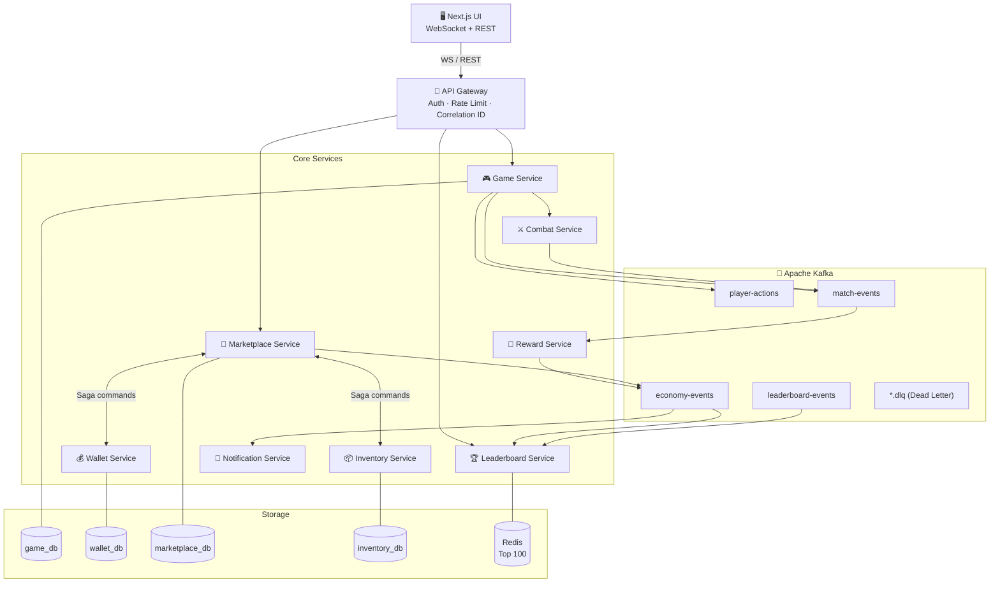
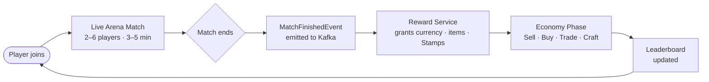
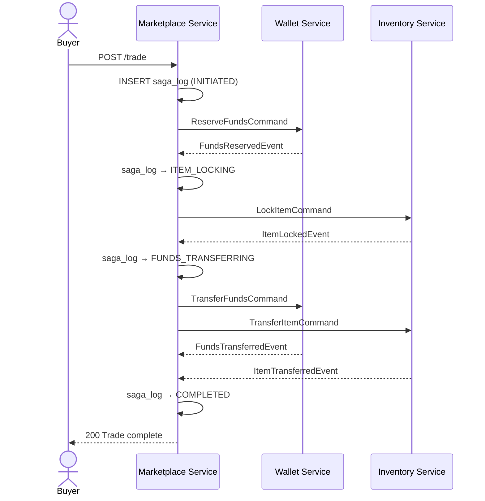
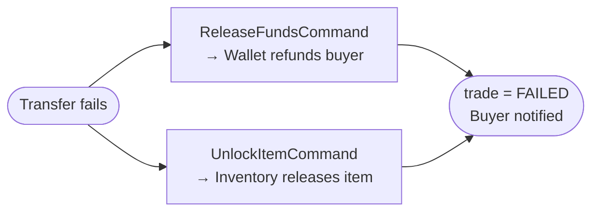
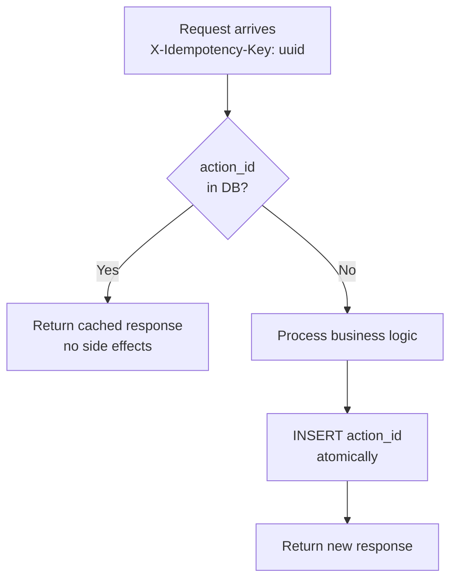
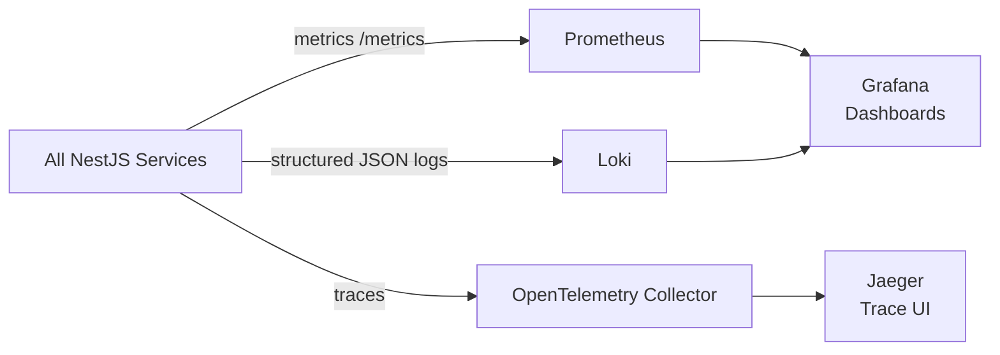

<div align="center">

# ⚔️ 𝔦𝔡𝔢𝔪𝔭𝔬

**A production-grade distributed systems reference built as a real-time tactical arena game — where the idempotency token is the game's core resource.**

[](https://github.com/jeziellopes/idempo/actions)
[](#project-status)
[](./LICENSE)
<br>
[](https://www.typescriptlang.org)
[](https://nestjs.com)
[](https://nextjs.org)
[](https://pnpm.io)
<br>
[](https://kafka.apache.org)
[](https://postgresql.org)
[](https://redis.io)
[](https://docker.com)
[](https://kubernetes.io)
[](https://prometheus.io)
[](https://grafana.com)

> ⚠️ **Architecture design in progress — not ready for development.**

</div>

---

## Overview

Players join live arena matches, fight to collect resources, then trade in an async economy between rounds. The game's core resource — the **idempo Stamp** — is the game-layer representation of an idempotency key: spending a Stamp seals an action, guaranteeing exactly-once resolution even under network retries. Under the hood, every interaction exercises a production-grade distributed systems pattern — from idempotent command handling to distributed Saga compensation.

This project exists to demonstrate — concretely and runnably — what top-tier distributed systems engineering looks like.

---

## Table of Contents

- [Architecture](#architecture)
- [Game Loop](#game-loop)
- [Services](#services)
- [Patterns Demonstrated](#patterns-demonstrated)
- [Saga: Trade Flow](#saga-trade-flow)
- [Idempotency Model](#idempotency-model)
- [Observability](#observability)
- [Tech Stack](#tech-stack)
- [Running the Stack](#running-the-stack)
- [Project Status](#project-status)
- [Documentation](#documentation)

---

## Architecture

> Draft — subject to change.



---

## Game Loop



---

## Services

| Service | Responsibility | DB | Emits |
|---|---|---|---|
| **API Gateway** | Auth, rate limiting, correlation ID | — | — |
| **Game Service** | Match lifecycle, action validation | `game_db` | `match-events` |
| **Combat Service** | Damage calc, death logic | stateless | `match-events` |
| **Reward Service** | Post-match reward grants | — | `economy-events` |
| **Wallet Service** | Currency debit/credit with strong consistency | `wallet_db` | `economy-events` |
| **Inventory Service** | Item ownership and trade locks | `inventory_db` | `economy-events` |
| **Marketplace Service** | Listings + Saga orchestrator | `marketplace_db` | `economy-events` |
| **Leaderboard Service** | CQRS read projection | `leaderboard_db` + Redis | — |
| **Notification Service** | Async push / email | stateless | — |

---

## Patterns Demonstrated

| Pattern | Where |
|---|---|
| **Idempotent HTTP commands** | API Gateway → Game Service (`X-Idempotency-Key`) |
| **idempo Stamp (game mechanic)** | Player spends a Stamp → `stampId` becomes `action_id` in `player_actions`; duplicate requests return original response |
| **Idempotent event consumers** | All Kafka consumers (`processed_events` table) |
| **Distributed Saga (choreography)** | Marketplace trade flow |
| **Saga compensation** | Trade rollback on any step failure |
| **Circuit breaker** | Marketplace → Wallet / Inventory (opossum) |
| **Retry + exponential backoff + jitter** | All inter-service HTTP calls |
| **Dead Letter Queue** | Failed Kafka messages after 3 retries |
| **CQRS** | Leaderboard write model vs Redis read projection |
| **Optimistic locking** | Wallet balance updates |
| **Event sourcing (append-only ledger)** | Wallet transactions table |
| **Partition-based ordering** | Kafka keyed by `playerId` |

---

## Saga: Trade Flow



**Compensation path** (if `TransferFundsCommand` fails):



---

## Idempotency Model



**Kafka consumers** mirror this — every handler checks `processed_events` before acting, inside the same DB transaction as the business write.

---

## Observability



**Key metrics exposed per service:**

- `http_request_duration_seconds` — latency histograms
- `kafka_consumer_lag` — per topic/consumer group
- `circuit_breaker_state` — open/closed/half-open gauge
- `saga_duration_seconds` — trade completion time
- `dlq_message_count_total` — dead letter accumulation
- `retry_count_total` — retry pressure

---

## Tech Stack

<table>
<tr><th>Layer</th><th>Technology</th></tr>
<tr><td><strong>Frontend</strong></td><td>Next.js 16 (App Router) · socket.io · shadcn/ui · Tailwind CSS v4 · Zustand</td></tr>
<tr><td><strong>Backend</strong></td><td>NestJS 11 · Apache Kafka · PostgreSQL 17 · Redis 7.4 LTS</td></tr>
<tr><td><strong>Resilience</strong></td><td>opossum (circuit breaker) · axios-retry · Kafka DLQ</td></tr>
<tr><td><strong>Observability</strong></td><td>Prometheus · Grafana · Jaeger · Loki · OpenTelemetry SDK · Pino</td></tr>
<tr><td><strong>Infrastructure</strong></td><td>Docker Compose (local) · Kubernetes · Helm · KEDA · Nx monorepo · pnpm</td></tr>
</table>

---

## Running the Stack

Every iteration has a working, runnable version. The two commands below validate any iteration end-to-end:

```bash
# 1. Start all infrastructure + app services
docker compose up -d

# 2. Run the E2E suite for a specific iteration (or all)
nx run e2e:e2e                              # all iterations
nx run e2e:e2e --testFile=iter1.e2e.ts     # Iteration 1 only
nx run e2e:e2e --testFile=iter2.e2e.ts     # Iteration 2 only
nx run e2e:e2e --testFile=iter3.e2e.ts     # Iteration 3 only
nx run e2e:e2e --testFile=iter4.e2e.ts     # Iteration 4 only
```

Unit + integration coverage is run separately:

```bash
pnpm coverage      # all services — enforces per-iteration coverage gates
```

An iteration is only **done** when both commands exit green. See [ROADMAP.md](ROADMAP.md) for the per-iteration Verification scenarios and [apps/e2e/](apps/e2e/) for the E2E test source.

---

## Project Status

| Deliverable | Status |
|---|---|
| Architecture diagram | 🟡 Draft |
| PRD (`PRD.md`) | 🟡 Draft |
| Technical specification (`SPEC.md`) | 🟡 Draft |
| Game mechanics (`GAME.md`) | 🟡 Draft |
| API contracts (`API.md`) | 🟡 Draft |
| Build roadmap (`ROADMAP.md`) | 🟡 Draft |
| Demo runbook (`RUNBOOK.md`) | 🟡 Draft |
| Observability plan (`OBSERVABILITY.md`) | 🟡 Draft |
| Deployment & scaling (`DEPLOYMENT.md`) | 🟡 Draft |
| ADR: monorepo (`docs/adr/001-monorepo.md`) | 🟡 Draft |
| Monorepo scaffold | ⬜ Not started |
| Shared packages (`contracts`, `kafka`, `observability`) | ⬜ Not started |
| Core services | ⬜ Not started |
| Marketplace Saga | ⬜ Not started |
| Observability stack | ⬜ Not started |
| Kubernetes manifests | ⬜ Not started |
| Frontend (arena + economy UI) | ⬜ Not started |

---

## Documentation

| File | Contents |
|---|---|
| [docs/PRD.md](docs/PRD.md) | Product requirements, user stories, feature scope |
| [docs/SPEC.md](docs/SPEC.md) | System architecture, event contracts, database schemas, saga, resilience patterns |
| [docs/GAME.md](docs/GAME.md) | Arena mechanics: grid, combat resolution, actions, Stamp-sealed actions, scoring |
| [docs/API.md](docs/API.md) | REST + WebSocket contracts: all endpoints, request/response DTOs, error codes |
| [ROADMAP.md](ROADMAP.md) | 4-iteration build roadmap with per-iteration deliverables and task checklists |
| [docs/RUNBOOK.md](docs/RUNBOOK.md) | Step-by-step failure injection scenarios demonstrating each distributed systems pattern |
| [docs/OBSERVABILITY.md](docs/OBSERVABILITY.md) | Metrics catalogue, Grafana dashboards, tracing config, structured log schema, alerting |
| [docs/DEPLOYMENT.md](docs/DEPLOYMENT.md) | Container strategy, Kubernetes resources, Kafka partitioning, database scaling, quick-start |
| [docs/adr/001-monorepo.md](docs/adr/001-monorepo.md) | ADR: why monorepo with Nx was chosen over multi-repo |
