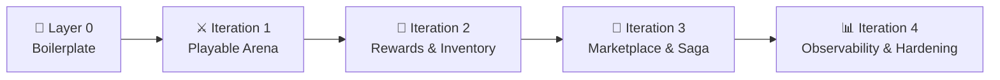

# idempo — Build Roadmap

**Related:** [docs/PRD.md](docs/PRD.md) · [docs/SPEC.md](docs/SPEC.md)

> **Principle:** Each iteration ships a working, playable version of the game. No iteration leaves the system broken. The boilerplate sprint is the multiplier — every service built in iterations 1–4 costs almost nothing to scaffold because all hard patterns are pre-wired in shared packages.

---

## Layer 0 — Boilerplate Sprint

> **Goal:** Templates and infrastructure that every future service inherits. No game logic yet.

**Shared Packages**

- [ ] `packages/contracts` — `BaseEvent` envelope + all event types
- [ ] `packages/kafka` — base producer, base consumer, idempotency hook, DLQ routing
- [ ] `packages/observability` — OpenTelemetry setup, Pino logger, `/metrics` NestJS module
- [ ] `packages/idempotency` — `X-Idempotency-Key` NestJS interceptor
- [ ] `packages/circuit-breaker` — `opossum` wrapper with Prometheus gauge export

**Infrastructure**

- [ ] Monorepo scaffold with Nx + pnpm workspaces
- [ ] `docker-compose.yml` — Kafka, PostgreSQL ×4, Redis, Jaeger, Prometheus, Grafana
- [ ] `apps/api-gateway`
  - [ ] `ConfigModule` + Joi env schema (fail-fast on missing `JWT_SECRET`)
  - [ ] `ThrottlerGuard` registered as `APP_GUARD` (rate limiting currently inert)
  - [ ] Global `ValidationPipe` + `GlobalExceptionFilter` → `{ error, detail, correlationId }`
  - [ ] `LoginDto` as validated class (`class-validator`)
  - [ ] JWT expiry 15 min; `POST /auth/refresh` stub (501)
  - [ ] `GET /health` (`@nestjs/terminus`)
  - [ ] `ProxyModule` — `http-proxy-middleware` wildcard forwarding to downstream services
  - [ ] `/metrics` moved to internal port 9091

**Output:** `nx generate @idempo/service <name>` scaffolds a fully wired NestJS service — Kafka, observability, idempotency, circuit breaker all included.

---

## Iteration 1 — Playable Arena (no economy)

> **Delivers:** A real, playable arena match from start to finish.

**Services added:** Game Service · Combat Service · Leaderboard Service  
**Frontend added:** Arena UI (WebSocket match view + live leaderboard)

- [ ] Game Service — match lifecycle, player action validation, `UNIQUE(action_id)` idempotency, Stamp-sealed action flow
- [ ] Combat Service — damage calc consumer, `PlayerAttackedEvent` emission
- [ ] Leaderboard Service — score projection (CQRS), Redis top-100 cache, stale fallback
- [ ] Next.js arena UI — join match, real-time grid, live leaderboard, Stamp spend UI

**Patterns live:** Idempotent HTTP commands · idempo Stamp mechanic · Event-driven services · CQRS read model · Partition-based ordering  
**Game state:** ✅ Matches run · ✅ Leaderboard updates · ❌ No rewards yet

---

## Iteration 2 — Rewards & Inventory

> **Delivers:** Winners receive resources after each match. Players can view wallet and inventory.

**Services added:** Reward Service · Wallet Service · Inventory Service  
**Frontend added:** Wallet page · Inventory page (read-only marketplace placeholder)

- [ ] Reward Service — `MatchFinishedEvent` consumer, idempotent reward grant (currency + items + Stamps)
- [ ] Wallet Service — credit/debit, append-only ledger, optimistic locking, `processed_events`, `stamp_balance`
- [ ] Inventory Service — item ownership, read endpoints
- [ ] Frontend wallet + inventory views

**Patterns live:** Idempotent event consumers · Append-only ledger · Optimistic locking  
**Game state:** ✅ Matches run · ✅ Rewards granted exactly once · ✅ Balances visible · ❌ No trading yet

---

## Iteration 3 — Marketplace & Saga

> **Delivers:** Full player-driven economy. Buy, sell, trade — with automatic rollback on failure.

**Services added:** Marketplace Service · Notification Service  
**Frontend added:** Marketplace UI · Trade history · DLQ Admin UI

- [ ] Marketplace Service — listings CRUD, Trade Saga orchestration, `saga_log`
- [ ] Inventory Service — item locking for trades (`LockItemCommand` / `UnlockItemCommand`)
- [ ] Circuit breakers: Marketplace → Wallet, Marketplace → Inventory
- [ ] Retry policies + DLQ consumers (3 retries → `*.dlq`)
- [ ] Notification Service — WebSocket push on trade complete/failed
- [ ] DLQ Admin UI — inspect and replay dead-lettered messages
- [ ] Frontend marketplace + trade flow

**Patterns live:** Distributed Saga · Saga compensation · Circuit breaker · Retry + backoff + jitter · DLQ  
**Game state:** ✅ Full game loop · ✅ Trades complete atomically · ✅ Failed trades compensate automatically

---

## Iteration 4 — Observability & Production Hardening

> **Delivers:** Every pattern from iterations 1–3 is visible, measurable, and demonstrable under failure.

**No new game features — this iteration makes everything observable and resilient at scale.**

- [ ] Prometheus metrics wired per service (full list in [docs/OBSERVABILITY.md](docs/OBSERVABILITY.md))
- [ ] Grafana dashboards: Service Health · Saga Funnel · Kafka Lag · Circuit Breaker Timeline
- [ ] Jaeger traces — end-to-end spans across all service hops
- [ ] Loki log aggregation with structured JSON fields
- [ ] Kubernetes manifests + HPA configs per service (see [docs/DEPLOYMENT.md](docs/DEPLOYMENT.md))
- [ ] All 6 failure scenarios demonstrable and documented (see [docs/RUNBOOK.md](docs/RUNBOOK.md))
- [ ] Demo runbook — step-by-step guide to trigger and observe each failure

---

*See [docs/PRD.md](docs/PRD.md) for product requirements and user stories. See [docs/SPEC.md](docs/SPEC.md) for technical implementation details.*
