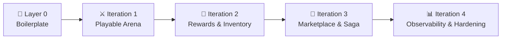

# idempo — Build Roadmap

**Related:** [docs/PRD.md](docs/PRD.md) · [docs/SPEC.md](docs/SPEC.md)

> **Principle:** Each iteration ships a working, playable version of the game. No iteration leaves the system broken. The boilerplate sprint is the multiplier — every service built in iterations 1–4 costs almost nothing to scaffold because all hard patterns are pre-wired in shared packages.
>
> **Definition of done:** An iteration is only complete when `pnpm build && docker compose up -d --build && nx run e2e:e2e` exits green. Passing the coverage gate alone is not sufficient — the stack must run end-to-end.

```mermaid
flowchart LR
    B["🧱 Layer 0<br/>Boilerplate"] --> I1["⚔️ Iteration 1<br/>Playable Arena"]
    I1 --> I2["🎁 Iteration 2<br/>Rewards & Inventory"]
    I2 --> I3["🏪 Iteration 3<br/>Marketplace & Saga"]
    I3 --> I4["📊 Iteration 4<br/>Observability & Hardening"]
```

---

## Layer 0 — Boilerplate Sprint

> **Goal:** Templates and infrastructure that every future service inherits. No game logic yet.

**Shared Packages**

- [x] `packages/contracts` — `BaseEvent` envelope + all event types
- [x] `packages/kafka` — base producer, base consumer, idempotency hook, DLQ routing
- [x] `packages/observability` — OpenTelemetry setup, Pino logger, `/metrics` NestJS module
- [x] `packages/idempotency` — `X-Idempotency-Key` NestJS interceptor
- [x] `packages/circuit-breaker` — `opossum` wrapper with Prometheus gauge export

**Infrastructure**

- [x] Monorepo scaffold with Nx + pnpm workspaces
- [x] `docker-compose.yml` — Kafka, PostgreSQL ×4, Redis, Jaeger, Prometheus, Grafana
- [x] `Dockerfile` — pre-built artifacts strategy (NestJS `nestjs` target + Next.js `nextjs` target); avoids Nx daemon issues inside Docker build sandboxes
- [x] All app services in `docker-compose.yml` with correct env wiring to Docker service names
- [x] `.env.example` — canonical list of all required environment variables with safe local-dev defaults
- [x] `apps/e2e` — Nx project with per-iteration E2E test files; `pnpm e2e` runs the full suite
- [x] `apps/api-gateway`
  - [x] `ConfigModule` + Joi env schema (fail-fast on missing `JWT_SECRET`)
  - [x] `ThrottlerGuard` registered as `APP_GUARD` (rate limiting currently inert)
  - [x] Global `ValidationPipe` + `GlobalExceptionFilter` → `{ error, detail, correlationId }`
  - [x] `LoginDto` as validated class (`class-validator`)
  - [x] JWT expiry 15 min; `POST /auth/test-token` bypass for E2E; refresh token rotation in `identity-service`
  - [x] `identity-service` — GitHub OAuth 2.0, stable `playerId` (server-assigned UUID), httpOnly JWT cookie issuance, JTI refresh rotation, `POST /auth/test-token` dev bypass ([ADR-002](docs/adr/002-github-oauth-identity.md))
  - [x] `GET /health` (`@nestjs/terminus`)
  - [x] `ProxyModule` — `http-proxy-middleware` wildcard forwarding to downstream services
  - [x] `/metrics` moved to internal port 9091

**Output:** `nx generate @idempo/service <name>` scaffolds a fully wired NestJS service — Kafka, observability, idempotency, circuit breaker all included.

**Coverage gate:** ≥90% lines/branches/functions on `api-gateway`. 100% on `src/filters/global-exception.filter.ts` (core request-handling logic). 100% on all auth files in `identity-service` (`auth.controller.ts`, `github.strategy.ts`, `jwt.strategy.ts`). Enforced via `@vitest/coverage-v8` — run `pnpm coverage`.

---

## Iteration 1 — Playable Arena (no economy)

> **Delivers:** A real, playable arena match from start to finish.

**Services added:** Game Service · Combat Service · Leaderboard Service  
**Frontend added:** Arena UI (WebSocket match view + live leaderboard)

- [x] Game Service — match lifecycle, player action validation, `UNIQUE(action_id)` idempotency, Stamp-sealed action flow
- [x] Combat Service — damage calc consumer, `PlayerAttackedEvent` emission
- [x] Leaderboard Service — score projection (CQRS), Redis top-100 cache, stale fallback
- [x] Next.js arena UI — join match, real-time grid, live leaderboard, Stamp spend UI

**Patterns live:** Idempotent HTTP commands · idempo Stamp mechanic · Event-driven services · CQRS read model · Partition-based ordering  
**Game state:** ✅ Matches run · ✅ Leaderboard updates · ❌ No rewards yet

**Coverage gate:** 100% lines/branches/functions on `match.service.ts`, `match.repository.ts`, `combat-engine.service.ts`, `leaderboard.service.ts`, `leaderboard.repository.ts` (core game logic). ≥90% on all other files in game-service, combat-service, and leaderboard-service. Enforced via `@vitest/coverage-v8` — run `pnpm coverage`.

**Verification:** `docker compose up -d && nx run e2e:e2e --testFile=iter1.e2e.ts`

E2E scenario: obtain `accessToken` cookie via `POST /auth/test-token` bypass → create match (no identity in body; gateway injects from JWT) → second player joins with their own cookie → submit Stamp-sealed attack → assert match state update via WebSocket + leaderboard entry visible at `GET /leaderboard/top100`.

---

## Iteration 1.5 — Solo Play & Visual Layer

> **Delivers:** Playable alone (NPC bots fill the lobby), spectator mode for any match, and a 3-D arena view with a live distributed-systems event HUD.

**Services changed:** Game Service (bot tick loop, `GET /matches/open`)  
**Frontend changed:** Lobby page (watch list), Arena (3-D toggle, spectator badge, event HUD)  
**New files:** `bot.strategy.ts`, `bot.service.ts`, `Arena3D.tsx`, `DistributedHUD.tsx`

- [x] DB: `is_bot BOOLEAN` on `match_players`; `idx_matches_status` index; `findOpenMatches()` query
- [x] Bot strategy — pure-function tactical AI (collect → defend → attack → move priority); 100% unit-testable
- [x] Bot service — `fillWithBots()` + `tickBots()`; full Kafka pipeline preserved (no shortcut)
- [x] Game service — lobby timeout fills bots when ≥1 human present; `GET /matches/open` endpoint
- [x] Spectator WebSocket — `spectator:join` / `spectator:leave`; `match:synced` push on join; read-only UI
- [x] 3-D arena — React Three Fiber v9 (React 19 compatible); lerp movement; in-world HP bars; death Sparkles; OrbitControls top-down camera; `ssr: false` dynamic import
- [x] Distributed HUD — `⚡ Event Stream` panel; last-20 Kafka events; round-trip latency; idempotency duplicate badges
- [x] Full-screen overlay layout — canvas fills viewport; 4 glass overlay cards; PENDING/FINISHED center overlays
- [x] Real-time sync fixes — HTTP initial state fetch on Arena mount; `tick` events set status to ACTIVE; server emits `match:synced` to joining clients

**Known gaps (addressed in Iteration 1.6):**
- ❌ Actions do not update game state — `move` never changes position, `attack` damage is emitted but not applied, `defend`/`collect` have no effect (Kafka pipeline records events but no consumer closes the loop in game-service)
- ❌ Controls are button-based (D-pad + UUID text field for attack) — not keyboard/mouse driven
- ❌ No pre-game movement allowed (PENDING state blocks all actions)

**Patterns live:** Rule-based NPC AI · Spectator WebSocket rooms · Three.js R3F in Next.js · Live DS event log  
**Game state:** ✅ Matches run · ✅ Bots tick · ✅ Any match watchable · ✅ 3-D view with DS HUD · ❌ Game state does not change (engine loop incomplete)

**Coverage gate:** 100% on `bot.strategy.ts`; ≥90% on `bot.service.ts`.

**Verification:** `docker compose up -d && nx run e2e:e2e --testFile=iter1b.e2e.ts`

E2E scenario: create match with single player → wait 30 s → assert bot fills slot → assert match transitions to ACTIVE → spectator joins via `GET /matches/open` + WS `spectator:join` → assert `match:synced` broadcast received → assert state broadcasts (tick) received in spectator client.

---

## Iteration 1.6 — Game Engine + Keyboard Controls

> **Delivers:** A genuinely playable arena — actions change game state, characters move, take damage, and gain resources. Keyboard-driven controls replace the on-screen button grid.

**Services changed:** Game Service (action processors, PlayerAttackedEvent consumer)  
**Frontend changed:** Arena UI (keyboard controls, auto-targeting, lobby warmup movement)

### Root cause of the static arena

The Kafka pipeline (idempotency, event routing, audit log) works correctly. However, the **game-service has no consumer** that reads the resulting events and applies them back to player state in the DB. The `match_players` table is never updated beyond the initial insert:

| Action | Kafka event emitted | DB update applied? |
|---|---|---|
| `move` | `PlayerActionEvent` → `player-actions` topic | ❌ `position_x/y` never updated |
| `attack` | → combat-service → `PlayerAttackedEvent` → `match-events` topic | ❌ `applyDamage()` exists but never called |
| `defend` | `PlayerActionEvent` recorded | ❌ `shields` never set |
| `collect` | `PlayerActionEvent` recorded | ❌ `resources` never incremented |

Because the tick loop broadcasts `repo.getPlayers()` (reading DB state), and nothing writes to DB, every tick broadcast sends the same initial state.

### What to build

**Backend: close the loop in game-service**

- [ ] `match.repository.ts` — add `applyMove(matchId, playerId, direction)`, `applyDefend(matchId, playerId)`, `applyCollect(matchId, playerId)`
- [ ] `match.service.ts` — after `insertAction()` + Kafka emit, synchronously apply move/defend/collect to DB (no extra async hop needed for non-combat actions)
- [ ] `match.service.ts` — allow `move` in PENDING state (pre-game warmup — just expand the status guard)
- [ ] `match/events.consumer.ts` (NEW) — Kafka consumer on `match-events` topic; handle `PlayerAttackedEvent` → `repo.applyDamage()`; handle `PlayerEliminatedEvent` (future) → mark player `alive=false`
- [ ] `match.module.ts` — wire the new consumer

**Frontend: keyboard-first controls**

- [ ] `hooks/useArenaControls.ts` (NEW) — `keydown` listener: W/S/A/D or arrows = move, Space = attack nearest alive enemy (auto-target by Chebyshev distance), E = collect, Q = defend, Tab = toggle stamp seal; throttled at 120 ms
- [ ] `components/arena/Arena.tsx` — replace ActionPanel overlay with compact keyboard legend bar
- [ ] `components/arena/ActionPanel.tsx` — repurpose as `<StampToggle>` sub-component only

**Patterns live:** Event-driven state projection · Synchronous action resolution · Keyboard game input  
**Game state:** ✅ All actions update state · ✅ Characters move · ✅ Combat deals damage · ✅ Resources collectible · ✅ Keyboard controls · ✅ Pre-game warmup movement

**Coverage gate:** 100% on `match.service.ts`, `match.repository.ts` (existing gates); ≥90% on new `events.consumer.ts`.

---

## Iteration 2 — Rewards & Inventory

> **Delivers:** Winners receive resources after each match. Players can view wallet and inventory.

**Services added:** Reward Service · Wallet Service · Inventory Service  
**Frontend added:** Wallet page · Inventory page (read-only marketplace placeholder)

- [ ] Reward Service — `MatchFinishedEvent` consumer, idempotent reward grant (currency + items + Stamps)
- [ ] Wallet Service — credit/debit, append-only ledger, optimistic locking, `processed_events`, `stamp_balance`
- [ ] Inventory Service — item ownership, read endpoints
- [ ] Frontend wallet + inventory views

**Patterns live:** Idempotent event consumers · Append-only ledger · Optimistic locking  
**Game state:** ✅ Matches run · ✅ Rewards granted exactly once · ✅ Balances visible · ❌ No trading yet

**Coverage gate:** 100% on `reward.service.ts`, `wallet.service.ts`, `wallet.repository.ts`, `inventory.service.ts` (ledger and reward core logic). ≥90% on all other files in reward-service, wallet-service, and inventory-service. Enforced via `@vitest/coverage-v8` — run `pnpm coverage`.

**Verification:** `docker compose up -d && nx run e2e:e2e --testFile=iter2.e2e.ts`

E2E scenario: complete a match → poll `GET /wallet/:playerId` until balance > 0 (max 15 s, Kafka consumer lag) → assert inventory contains at least one item at `GET /inventory/:playerId`.

---

## Iteration 3 — Marketplace & Saga

> **Delivers:** Full player-driven economy. Buy, sell, trade — with automatic rollback on failure.

**Services added:** Marketplace Service · Notification Service  
**Frontend added:** Marketplace UI · Trade history · DLQ Admin UI

- [ ] Marketplace Service — listings CRUD, Trade Saga orchestration, `saga_log`
- [ ] Inventory Service — item locking for trades (`LockItemCommand` / `UnlockItemCommand`)
- [ ] Circuit breakers: Marketplace → Wallet, Marketplace → Inventory
- [ ] Retry policies + DLQ consumers (3 retries → `*.dlq`)
- [ ] Notification Service — WebSocket push on trade complete/failed
- [ ] DLQ Admin UI — inspect and replay dead-lettered messages
- [ ] Frontend marketplace + trade flow

**Patterns live:** Distributed Saga · Saga compensation · Circuit breaker · Retry + backoff + jitter · DLQ  
**Game state:** ✅ Full game loop · ✅ Trades complete atomically · ✅ Failed trades compensate automatically

**Coverage gate:** 100% on `trade.saga.ts`, `marketplace.service.ts`, `saga-log.repository.ts` (saga orchestration and compensation logic). ≥90% on all other files in marketplace-service and notification-service. Enforced via `@vitest/coverage-v8` — run `pnpm coverage`.

**Verification:** `docker compose up -d && nx run e2e:e2e --testFile=iter3.e2e.ts`

E2E scenario (happy path): create listing → execute trade → assert saga state = `COMPLETED` + item transferred to buyer + seller wallet credited. Compensation path: inject wallet-service failure mid-saga → assert saga state = `FAILED`, buyer balance restored, item unlocked.

---

## Iteration 4 — Observability & Production Hardening

> **Delivers:** Every pattern from iterations 1–3 is visible, measurable, and demonstrable under failure.

**No new game features — this iteration makes everything observable and resilient at scale.**

- [ ] Prometheus metrics wired per service (full list in [docs/OBSERVABILITY.md](docs/OBSERVABILITY.md))
- [ ] Grafana dashboards: Service Health · Saga Funnel · Kafka Lag · Circuit Breaker Timeline
- [ ] Jaeger traces — end-to-end spans across all service hops
- [ ] Loki log aggregation with structured JSON fields
- [ ] Kubernetes manifests + HPA configs per service (see [docs/DEPLOYMENT.md](docs/DEPLOYMENT.md))
- [ ] All 6 failure scenarios demonstrable and documented (see [docs/RUNBOOK.md](docs/RUNBOOK.md))
- [ ] Demo runbook — step-by-step guide to trigger and observe each failure

**Coverage gate:** Full repo coverage report generated and attached to the CI run. No regression below 90% on any service; 100% maintained on all core business logic files named in iterations 1–3. Enforced via `@vitest/coverage-v8` — run `pnpm coverage`.

**Verification:** `docker compose up -d && nx run e2e:e2e --testFile=iter4.e2e.ts`

E2E scenario: trigger each of the 6 RUNBOOK failure scenarios programmatically → query Prometheus API (`GET /api/v1/query`) to assert the relevant metric crossed its expected threshold (e.g. `circuit_breaker_state == 1`, `dlq_message_count_total > 0`). All Grafana dashboards must load without data gaps.

---

*See [docs/PRD.md](docs/PRD.md) for product requirements and user stories. See [docs/SPEC.md](docs/SPEC.md) for technical implementation details.*
