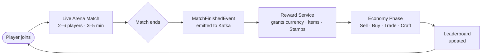

# idempo — Product Requirements Document

**Version:** 1.0  
**Date:** 2026-03-02  
**Status:** Draft  
**Related:** [SPEC.md](SPEC.md) · [API.md](API.md) · [GAME.md](GAME.md) · [ROADMAP.md](../ROADMAP.md) · [RUNBOOK.md](RUNBOOK.md) · [README.md](../README.md)

---

## Table of Contents

1. [Purpose & Background](#1-purpose--background)
2. [Target Users](#2-target-users)
3. [Problem Statement](#3-problem-statement)
4. [Goals & Success Metrics](#4-goals--success-metrics)
5. [User Stories](#5-user-stories)
6. [Feature Scope](#6-feature-scope)
7. [Non-Goals](#7-non-goals)
8. [Constraints & Assumptions](#8-constraints--assumptions)

> **Acceptance criteria & demo scenarios** → [RUNBOOK.md](RUNBOOK.md)  
> **Build roadmap** → [ROADMAP.md](../ROADMAP.md)

---

## 1. Purpose & Background

**idempo** is a real-time tactical arena game with an asynchronous player-driven economy between matches.

Its primary purpose is dual:

1. **Playable game** — players join arena matches, fight to collect resources, then trade in a marketplace economy between rounds.
2. **Engineering reference** — every interaction exercises a production-grade distributed systems pattern, providing a concrete, runnable demonstration of senior-level backend engineering.

### Game Loop

### Core Game Rule — The idempo Stamp

Every player holds a supply of **Stamps** — the `idempo` token the game is named after:

- **Earning:** Stamps are granted as post-match rewards alongside currency and items.
- **Spending:** Before submitting a critical arena action (attack, defend, collect), a player may spend one Stamp to **seal** it.
- **Effect of sealing:** A sealed action resolves **exactly once**, regardless of lag, retry, or duplicate submission. The server stores the stamp's UUID as the idempotency key and ignores any duplicate carrying the same key.
- **Irreversibility:** A sealed action cannot be cancelled or overridden — the commitment is the cost of the guarantee.
- **Strategic tension:** Stamps are scarce. Spending one secures a decisive blow; hoarding them risks losing critical actions to network jitter.

> **Engineering mapping:** The Stamp is the game-layer representation of the `X-Idempotency-Key` header. Spending a stamp in the UI directly causes that UUID to be stored in `player_actions.action_id` and enforced with a `UNIQUE` constraint — the game mechanic and the backend pattern are the same artefact.

---

## 2. Target Users

### Persona A — Competitive Player

- Plays arena matches to climb the global leaderboard
- Motivated by ranking and rare item collection
- Needs: low-latency match experience, reliable reward grants, accurate leaderboard

### Persona B — Economy-Focused Player

- Joins matches primarily to farm resources
- Spends most time in the marketplace — buying low, selling high, crafting equipment
- Needs: reliable trade execution, real-time market prices, trade history

### Persona C — Engineer / Reviewer (meta-persona)

- Reviewing this project as a portfolio piece or system design reference
- Needs: clear demonstration of each distributed systems pattern, observable behaviour, reproducible failure scenarios

---

## 3. Problem Statement

Building a multiplayer game with a player-driven economy requires solving several hard distributed systems problems simultaneously:

| Challenge | Why It's Hard |
|---|---|
| Player actions arrive concurrently | Race conditions, duplicate submissions |
| Match results trigger downstream chains | Latency, partial failures, retries |
| Trades involve multiple services atomically | No single DB transaction across services |
| Currency is safety-critical | Double-spend must be impossible |
| Leaderboard must be fast | Thousands of reads per second |
| Services fail independently | System must degrade gracefully |

This project exists to solve these problems in a realistic context, not as a toy demo.

---

## 4. Goals & Success Metrics

### Engineering Goals

| Pattern | Demonstrated By |
|---|---|
| Idempotent HTTP commands | Duplicate attack request → single damage application |
| idempo Stamp mechanic | Player-visible idempotency token — stamp UUID becomes the `action_id` idempotency key in `player_actions` |
| Idempotent event consumers | Kafka redelivery → no double reward |
| Distributed Saga | Trade completes atomically across 3 services |
| Saga compensation | Mid-trade failure → full rollback, buyer refunded |
| Circuit breaker | Wallet down → trades rejected fast, not hung |
| Retry + backoff + jitter | Transient errors recovered without thundering herd |
| Dead Letter Queue | Poison messages isolated, inspectable |
| CQRS | Leaderboard reads from Redis, writes to Postgres |
| Observability | Every pattern is visible in Grafana / Jaeger |

### Performance Targets

| Metric | Target |
|---|---|
| Arena action round-trip (p99) | < 100 ms |
| Trade saga completion (p95) | < 2 s |
| Leaderboard read (p99) | < 20 ms (Redis cache hit) |
| Event processing lag | < 500 ms under normal load |
| Kafka consumer lag at peak | < 1 000 messages |

### Reliability Targets

| Metric | Target |
|---|---|
| Trade idempotency | 100% — no double charges ever |
| Reward idempotency | 100% — no double grants ever |
| Saga compensation success rate | > 99% under failure injection |
| Circuit breaker trip time | < 10 s after failure threshold |

---

## 5. User Stories

### Arena Phase

| ID | Story | Acceptance Criteria |
|---|---|---|
| US-01 | As a player, I want to join a match so I can compete | Match created, player assigned, WebSocket connection established |
| US-02 | As a player, I want to attack an opponent so I can deal damage | Damage calculated, event emitted; duplicate attack (same `actionId`) has no second effect |
| US-02b | As a player, I want to spend a Stamp to seal my action so it resolves exactly once even under lag | Sealed action stored with stamp UUID as `action_id`; duplicate submission returns original response; stamp balance decremented exactly once |
| US-03 | As a match winner, I want to receive rewards automatically | `MatchFinishedEvent` triggers `RewardGrantedEvent`; wallet and inventory updated exactly once |
| US-04 | As a player, I want to see live rankings during and after a match | Leaderboard reflects current scores; stale cache served if DB is slow |

### Economy Phase

| ID | Story | Acceptance Criteria |
|---|---|---|
| US-05 | As a player, I want to list an item for sale | Listing created and visible to other players |
| US-06 | As a buyer, I want to purchase a listed item | Trade saga completes: funds debited, item transferred, both parties notified |
| US-07 | As a buyer, I want a failed trade to refund me automatically | If saga fails at any step, compensation runs: funds released, item unlocked, trade marked FAILED |
| US-08 | As a player, I want to be notified when my trade completes or fails | Notification delivered via WebSocket push |
| US-09 | As a player, I want to view my wallet balance and transaction history | Append-only ledger readable, balance accurate |

### Operational

| ID | Story | Acceptance Criteria |
|---|---|---|
| US-10 | As an operator, I want to inspect failed messages | DLQ Admin UI shows message, error, retry count; manual replay possible |
| US-11 | As an operator, I want to see system health at a glance | Grafana dashboard shows per-service latency, Kafka lag, circuit breaker states |
| US-12 | As an operator, I want to trace a request end-to-end | Jaeger shows full span tree from frontend through all services |

---

## 6. Feature Scope

### v1.0 (This Release)

- Arena match lifecycle (2–6 players, 3–5 min rounds, grid-based)
- Player actions: attack, defend, collect resources
- idempo Stamps — scarce token earned as match reward; spent in-arena to seal actions with an exactly-once guarantee
- Post-match reward grants (currency + items + Stamps)
- Marketplace: item listings, buy/sell
- Trade Saga with full compensation
- Wallet: balance, hold, transfer, ledger
- Inventory: item ownership, locking
- Global leaderboard (top 100, Redis-cached)
- Async notifications (WebSocket)
- DLQ Admin UI (inspect + replay)
- Full observability stack (Prometheus, Grafana, Jaeger, Loki)
- Kubernetes deployment with HPA

### Deferred (Post v1.0)

- Mobile client
- Equipment crafting system
- Player-to-player direct (non-marketplace) trades
- Tournament / bracket mode
- Item rarity / drop rate system
- Chat system
- OAuth / social login

---

## 7. Non-Goals

- This is **not** a production game launch — it is an engineering reference
- No real money or real-value assets
- No anti-cheat system
- No GDPR / data retention compliance in v1
- No mobile-native client (web only)
- No ML/AI opponents (all player-vs-player)

---

## 8. Constraints & Assumptions

| Constraint | Detail |
|---|---|
| Team size | 1–3 engineers |
| Timeline | 4 weeks to working demo |
| Infrastructure | Local: Docker Compose; Cloud: single-region k8s cluster |
| Budget | Zero cloud spend for development (local k3s / Docker) |
| Technology | NestJS, Kafka, PostgreSQL, Redis — no negotiation on core stack |
| Repository | Monorepo with Nx (see [SPEC.md §2](SPEC.md#2-repository-strategy)) |

**Assumptions:**

- Players are authenticated via JWT before any game or economy action
- All currency values are stored in minor units (integer cents) to avoid floating point errors
- Kafka provides at-least-once delivery; services handle deduplication
- All services run in the same Kubernetes namespace for v1

---

*This PRD is the authoritative source for product requirements, user stories, and feature scope. See [ROADMAP.md](../ROADMAP.md) for the build roadmap, [RUNBOOK.md](RUNBOOK.md) for demo scenarios, and [SPEC.md](SPEC.md) for technical implementation details.*
