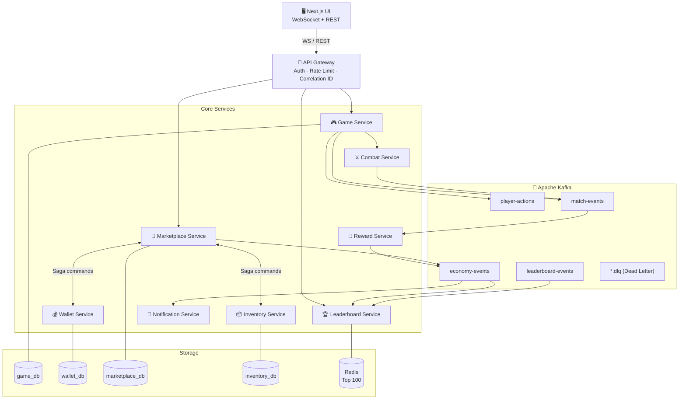

# idempo — Technical Specification

**Version:** 1.0  
**Date:** 2026-03-02  
**Status:** Active

---

## Table of Contents

1. [System Architecture](#1-system-architecture)
2. [Microservices Catalogue](#2-microservices-catalogue)
3. [Event Contracts](#3-event-contracts)
4. [Database Design](#4-database-design)
5. [Idempotency Strategy](#5-idempotency-strategy)
6. [Saga Pattern — Marketplace Trade](#6-saga-pattern--marketplace-trade)
7. [Resilience Patterns](#7-resilience-patterns)
8. [Tech Stack](#8-tech-stack)
9. [Folder Structure](#9-folder-structure)

> Repository strategy decision → [adr/001-monorepo.md](adr/001-monorepo.md)  
> Observability plan (metrics, dashboards, tracing, alerting) → [OBSERVABILITY.md](OBSERVABILITY.md)  
> Deployment & scaling (Kubernetes, Kafka partitioning, DB scaling) → [DEPLOYMENT.md](DEPLOYMENT.md)  
> For product requirements, user stories, acceptance criteria, and build roadmap — see [PRD.md](PRD.md)

**Related:** [PRD.md](PRD.md) · [API.md](API.md) · [GAME.md](GAME.md) · [OBSERVABILITY.md](OBSERVABILITY.md) · [DEPLOYMENT.md](DEPLOYMENT.md) · [adr/001-monorepo.md](adr/001-monorepo.md)

---

## 1. System Architecture



---

## 2. Microservices Catalogue

### 3.1 API Gateway

| Attribute | Detail |
|---|---|
| Responsibility | Auth (JWT), rate limiting, correlation ID injection, WebSocket upgrade, request proxying |
| Exposes | `REST /api/**`, `WS /game`, `GET /health` |
| Downstream | Routes to all core services via `http-proxy-middleware` |
| Key libraries | `@nestjs/throttler`, `passport-jwt`, `@nestjs/config`, `@nestjs/axios`, `http-proxy-middleware`, `@nestjs/terminus`, `class-validator` |
| Env validation | Joi schema via `@nestjs/config`; startup fails if `JWT_SECRET` is absent |
| Proxy strategy | `http-proxy-middleware` wildcard forwarding; per-service URLs from env (`GAME_SERVICE_URL`, `WALLET_SERVICE_URL`, etc.) |
| Auth tokens | Access token 15 min; `POST /auth/refresh` stub (501) in Phase 0, full impl in Phase 1 |

---

### 3.2 Game Service

| Attribute | Detail |
|---|---|
| Responsibility | Match lifecycle, player action validation, event emission |
| Consumes | `player-actions` topic |
| Produces | `match-events` (MatchStartedEvent, MatchFinishedEvent) |
| Idempotency | `UNIQUE(action_id)` in `player_actions` table |
| Database | PostgreSQL — `game_db` |

---

### 3.3 Combat Service

| Attribute | Detail |
|---|---|
| Responsibility | Damage calculation, death logic |
| Consumes | `player-actions` (attack type) |
| Produces | `match-events` (PlayerAttackedEvent, PlayerEliminatedEvent) |
| Stateless | No own DB; derives state from events |

---

### 3.4 Reward Service

| Attribute | Detail |
|---|---|
| Responsibility | Post-match reward grants |
| Consumes | `match-events` (MatchFinishedEvent) |
| Produces | `economy-events` (RewardGrantedEvent) |
| Idempotency | `processed_event_ids` table keyed by `eventId` |

---

### 3.5 Wallet Service

| Attribute | Detail |
|---|---|
| Responsibility | Player currency — debit, credit, hold, release; idempo Stamp balance |
| Consistency | Strong (PostgreSQL transactions + optimistic locking) |
| Consumes | Internal Saga commands via Kafka |
| Produces | `economy-events` (FundsReservedEvent, FundsReleasedEvent) |
| Database | PostgreSQL — `wallet_db` |

---

### 3.6 Inventory Service

| Attribute | Detail |
|---|---|
| Responsibility | Item ownership, locking for trades |
| Consumes | Internal Saga commands |
| Produces | `economy-events` (ItemLockedEvent, ItemTransferredEvent) |
| Database | PostgreSQL — `inventory_db` |

---

### 3.7 Marketplace Service

| Attribute | Detail |
|---|---|
| Responsibility | Listings management, Saga orchestration for trades |
| Consumes | REST from API Gateway, `economy-events` (saga replies) |
| Produces | `economy-events` (TradeRequestedEvent, saga commands) |
| Database | PostgreSQL — `marketplace_db` (includes `saga_log`) |
| Circuit breakers | To Wallet Service, to Inventory Service |

---

### 3.8 Leaderboard Service

| Attribute | Detail |
|---|---|
| Responsibility | Ranking projection (CQRS read model) |
| Consumes | `leaderboard-events` (ScoreUpdatedEvent) |
| Exposes | `GET /leaderboard/top100` |
| Database | PostgreSQL write model + Redis read cache (TTL 60 s) |
| Fallback | Return stale Redis cache if DB is slow |

---

### 3.9 Notification Service

| Attribute | Detail |
|---|---|
| Responsibility | Async player notifications (WebSocket push / email) |
| Consumes | `economy-events`, `match-events` |
| Stateless | No own DB |

---

## 3. Event Contracts

All events share a common envelope:

```typescript
// packages/contracts/src/base-event.ts
interface BaseEvent {
  eventId: string;        // UUID v4 — globally unique
  correlationId: string;  // request chain ID for tracing
  causationId: string;    // eventId of the parent event
  version: number;        // schema version
  timestamp: string;      // ISO 8601
}
```

### 4.1 PlayerAttackedEvent

```json
{
  "eventId": "uuid",
  "correlationId": "uuid",
  "causationId": "uuid",
  "version": 1,
  "actionId": "uuid",
  "playerId": "uuid",
  "targetId": "uuid",
  "damage": 30,
  "timestamp": "2026-03-02T14:00:00Z"
}
```

**Topic:** `match-events`  
**Key (partition):** `matchId`

---

### 4.1b StampUsedEvent

```json
{
  "eventId": "uuid",
  "correlationId": "uuid",
  "causationId": "uuid",
  "version": 1,
  "stampId": "uuid",
  "actionId": "uuid",
  "playerId": "uuid",
  "matchId": "uuid",
  "timestamp": "2026-03-02T14:00:00Z"
}
```

**Topic:** `match-events`  
**Key:** `matchId`  
**Note:** `stampId` is identical to `actionId` — the stamp UUID *is* the idempotency key. This event is emitted atomically alongside `PlayerAttackedEvent` and confirmed only when the `player_actions` row is committed.

---

### 4.2 MatchFinishedEvent

```json
{
  "eventId": "uuid",
  "correlationId": "uuid",
  "causationId": "uuid",
  "version": 1,
  "matchId": "uuid",
  "winnerId": "uuid",
  "rewards": [
    { "type": "currency", "amount": 500 },
    { "type": "item", "itemId": "rare_sword_01" },
    { "type": "stamps", "amount": 3 }
  ],
  "finalScores": [
    { "playerId": "uuid", "score": 320 }
  ],
  "timestamp": "2026-03-02T14:05:00Z"
}
```

**Topic:** `match-events`  
**Key:** `matchId`

---

### 4.3 TradeRequestedEvent

```json
{
  "eventId": "uuid",
  "correlationId": "uuid",
  "causationId": "uuid",
  "version": 1,
  "tradeId": "uuid",
  "buyerId": "uuid",
  "sellerId": "uuid",
  "itemId": "uuid",
  "price": 500,
  "timestamp": "2026-03-02T14:10:00Z"
}
```

**Topic:** `economy-events`  
**Key:** `tradeId`

---

### 4.4 Saga Command Events

| Event | Topic | Purpose |
|---|---|---|
| `ReserveFundsCommand` | `economy-events` | Tell Wallet to hold funds |
| `FundsReservedEvent` | `economy-events` | Wallet reply — success |
| `FundsReservationFailedEvent` | `economy-events` | Wallet reply — insufficient |
| `LockItemCommand` | `economy-events` | Tell Inventory to lock item |
| `ItemLockedEvent` | `economy-events` | Inventory reply — success |
| `TransferFundsCommand` | `economy-events` | Final debit |
| `TransferItemCommand` | `economy-events` | Final transfer |
| `ReleaseFundsCommand` | `economy-events` | Compensation — refund |
| `UnlockItemCommand` | `economy-events` | Compensation — release lock |

---

## 4. Database Design

### 4.1 Game DB (`game_db`)

```sql
-- matches
CREATE TABLE matches (
  id           UUID PRIMARY KEY,
  status       VARCHAR(20) NOT NULL,  -- PENDING | ACTIVE | FINISHED
  started_at   TIMESTAMPTZ,
  finished_at  TIMESTAMPTZ,
  created_at   TIMESTAMPTZ DEFAULT now()
);

-- match_players
CREATE TABLE match_players (
  match_id   UUID REFERENCES matches(id),
  player_id  UUID NOT NULL,
  team       SMALLINT,
  final_score INT DEFAULT 0,
  PRIMARY KEY (match_id, player_id)
);

-- player_actions (idempotency anchor)
CREATE TABLE player_actions (
  action_id    UUID PRIMARY KEY,          -- client-provided, UNIQUE enforced
  match_id     UUID REFERENCES matches(id),
  player_id    UUID NOT NULL,
  action_type  VARCHAR(30) NOT NULL,
  payload      JSONB,
  created_at   TIMESTAMPTZ DEFAULT now()
);
```

---

### 4.2 Wallet DB (`wallet_db`)

```sql
-- wallets
CREATE TABLE wallets (
  player_id       UUID PRIMARY KEY,
  balance         BIGINT NOT NULL DEFAULT 0,  -- stored in minor units (cents)
  held_amount     BIGINT NOT NULL DEFAULT 0,
  stamp_balance   INT NOT NULL DEFAULT 0,     -- idempo Stamps available to spend in-arena
  version         INT NOT NULL DEFAULT 0,     -- optimistic lock
  updated_at      TIMESTAMPTZ DEFAULT now()
);

-- transactions (append-only ledger)
CREATE TABLE transactions (
  id           UUID PRIMARY KEY,
  player_id    UUID NOT NULL,
  amount       BIGINT NOT NULL,              -- positive = credit, negative = debit
  type         VARCHAR(30) NOT NULL,         -- REWARD | TRADE_HOLD | TRADE_RELEASE | ...
  reference_id UUID,                         -- saga tradeId or reward eventId
  created_at   TIMESTAMPTZ DEFAULT now()
);

-- idempotency store
CREATE TABLE processed_events (
  event_id    UUID PRIMARY KEY,
  processed_at TIMESTAMPTZ DEFAULT now()
);
```

---

### 4.3 Marketplace DB (`marketplace_db`)

```sql
-- listings
CREATE TABLE listings (
  id         UUID PRIMARY KEY,
  seller_id  UUID NOT NULL,
  item_id    UUID NOT NULL,
  price      BIGINT NOT NULL,
  status     VARCHAR(20) NOT NULL,  -- ACTIVE | SOLD | CANCELLED
  created_at TIMESTAMPTZ DEFAULT now()
);

-- trades
CREATE TABLE trades (
  id          UUID PRIMARY KEY,
  listing_id  UUID REFERENCES listings(id),
  buyer_id    UUID NOT NULL,
  seller_id   UUID NOT NULL,
  item_id     UUID NOT NULL,
  price       BIGINT NOT NULL,
  status      VARCHAR(20) NOT NULL,  -- PENDING | COMPLETED | FAILED
  created_at  TIMESTAMPTZ DEFAULT now()
);

-- saga_log (saga state machine)
CREATE TABLE saga_log (
  trade_id    UUID PRIMARY KEY,
  state       VARCHAR(40) NOT NULL,
  payload     JSONB,
  updated_at  TIMESTAMPTZ DEFAULT now()
);

-- idempotency store
CREATE TABLE processed_events (
  event_id     UUID PRIMARY KEY,
  processed_at TIMESTAMPTZ DEFAULT now()
);
```

---

### 4.4 Leaderboard DB

```sql
-- ranking_projection (CQRS read model)
CREATE TABLE ranking_projection (
  player_id   UUID PRIMARY KEY,
  username    VARCHAR(60) NOT NULL,
  score       BIGINT NOT NULL DEFAULT 0,
  rank        INT,
  updated_at  TIMESTAMPTZ DEFAULT now()
);
```

**Redis:** `leaderboard:top100` — sorted set, TTL 60 s, populated by projector.

---

## 5. Idempotency Strategy

### 5.1 HTTP Layer

Clients attach a unique key to mutating requests:

```
X-Idempotency-Key: <uuid>
```

The API Gateway injects it as `correlationId`. Game Service stores it as `action_id`:

```
Request arrives
      │
      ▼
SELECT FROM player_actions WHERE action_id = $1
      │
  ┌───┴────────────────────────┐
  │ Found                      │ Not Found
  ▼                            ▼
Return cached response    Process & INSERT
(HTTP 200 / original)     Return new response
```

**Guarantee:** At-most-once side effects even under client retries.

---

### 5.2 Kafka Consumer Idempotency

Every consumer follows this pattern:

```typescript
async handleEvent(event: BaseEvent) {
  const alreadyProcessed = await this.db.query(
    'SELECT 1 FROM processed_events WHERE event_id = $1',
    [event.eventId]
  );
  if (alreadyProcessed) return; // skip — idempotent

  await this.db.transaction(async (trx) => {
    await this.processBusinessLogic(event, trx);
    await trx.query(
      'INSERT INTO processed_events (event_id) VALUES ($1)',
      [event.eventId]
    );
  });
}
```

**Guarantee:** Exactly-once business effect under at-least-once Kafka delivery.

---

### 5.3 Stamp-Sealed Actions (Game-Layer Idempotency)

The idempo Stamp bridges game narrative and backend guarantee. When a player seals an action:

```
Player selects "Seal with Stamp" in UI
      │
      ▼
Client generates stampId (UUID v4)
Attaches as X-Idempotency-Key header
      │
      ▼
Game Service — single DB transaction:
  1. Decrement stamp_balance  (optimistic lock check)
  2. INSERT player_actions    (UNIQUE action_id = stampId)
  3. Emit StampUsedEvent + PlayerAttackedEvent
      │
  ┌───┴────────────────────────────┐
  │ Duplicate arrives (retry) │ First request              │
  ▼                           ▼
SELECT player_actions       Process & INSERT
WHERE action_id = stampId   stamp_balance decremented once
Return cached response      Emit events once
(stamp NOT decremented again)
```

**Key properties:**
- `stampId` and `action_id` are the same UUID — the token is the key
- Stamp deduction and `player_actions` insertion happen in the same DB transaction — no partial state
- A duplicate submission does not deduct a second Stamp
- An unsealed action submits without an idempotency key and carries no double-application protection

---

## 6. Saga Pattern — Marketplace Trade

### 6.1 State Machine

```
INITIATED
    │
    ▼
FUNDS_RESERVING ──(FundsReservationFailed)──▶ COMPENSATING_FAILED
    │
    │ FundsReservedEvent
    ▼
ITEM_LOCKING ──(ItemLockFailed)──▶ COMPENSATING_FUNDS_RELEASE
    │
    │ ItemLockedEvent
    ▼
FUNDS_TRANSFERRING
    │
    │ (failure) ──▶ COMPENSATING_FULL
    │
    │ FundsTransferredEvent
    ▼
ITEM_TRANSFERRING
    │
    │ ItemTransferredEvent
    ▼
COMPLETED
```

### 6.2 Happy Path

```
Buyer → POST /marketplace/trade
           │
           ▼
  Marketplace stores trade (INITIATED)
  Emits → ReserveFundsCommand
           │
           ▼
  Wallet reserves funds → FundsReservedEvent
           │
           ▼
  Marketplace (ITEM_LOCKING)
  Emits → LockItemCommand
           │
           ▼
  Inventory locks item → ItemLockedEvent
           │
           ▼
  Marketplace emits → TransferFundsCommand + TransferItemCommand
           │
           ▼
  Both complete → trade status = COMPLETED
```

### 6.3 Compensation (Step 5 failure)

```
TransferFundsCommand fails
           │
           ▼
  Marketplace enters COMPENSATING_FULL
  Emits → ReleaseFundsCommand
  Emits → UnlockItemCommand
           │
           ▼
  Wallet credits buyer back
  Inventory unlocks item
           │
           ▼
  trade status = FAILED
  Buyer notified
```

All state transitions are persisted to `saga_log` before emitting commands.

---

## 7. Resilience Patterns

### 7.1 Circuit Breaker

Applied on Marketplace Service outbound calls using `opossum`:

| Target | Threshold (failure rate) | Timeout | Fallback |
|---|---|---|---|
| Wallet Service | 50% over 10 s | 3 s | Reject trade with 503 |
| Inventory Service | 50% over 10 s | 3 s | Reject trade with 503 |
| Leaderboard Service | 60% over 30 s | 5 s | Return stale Redis cache |

States: `CLOSED` → `OPEN` → `HALF_OPEN` → `CLOSED`

Circuit breaker state is exported as a Prometheus gauge:
```
circuit_breaker_state{service="wallet",state="open"} 1
```

---

### 7.2 Retry Policy

All inter-service HTTP calls:

```typescript
{
  retries: 3,
  backoff: 'exponential',
  initialDelay: 100,   // ms
  maxDelay: 2000,      // ms
  jitter: true
}
```

Kafka consumer retries: 3 attempts before routing to DLQ topic `<topic>.dlq`.

---

### 7.3 Dead Letter Queue

Each Kafka topic has a corresponding DLQ:

| Source Topic | DLQ Topic |
|---|---|
| `economy-events` | `economy-events.dlq` |
| `match-events` | `match-events.dlq` |
| `player-actions` | `player-actions.dlq` |

An Admin UI (React + custom consumer) allows inspection and manual replay.

---

## 8. Tech Stack

### Frontend

| Tool | Purpose |
|---|---|
| Next.js 16 (App Router) | UI + SSR |
| WebSocket (`socket.io-client`) | Real-time arena |
| shadcn/ui + Tailwind CSS v4 | Component library |
| Zustand | Client state |

### Backend

| Tool | Purpose |
|---|---|
| NestJS 11 | All microservices |
| Apache Kafka | Event bus |
| PostgreSQL 17 | Persistent data stores |
| Redis 7.4 LTS | Leaderboard cache + session store |
| opossum 9 | Circuit breaker |
| Pino 10 | Structured logging |
| OpenTelemetry SDK (api 1.9 / sdk-node 0.212) | Tracing instrumentation |
| `@nestjs/config` + Joi | Environment variable schema validation; fail-fast on missing secrets |
| `class-validator` + `class-transformer` | DTO validation on all incoming request bodies |
| `http-proxy-middleware` | API Gateway wildcard request forwarding to downstream services |
| `@nestjs/terminus` | Health checks (`GET /health`) for Kubernetes probes |

### Infrastructure

| Tool | Purpose |
|---|---|
| Docker + Docker Compose | Local development |
| Kubernetes (k3s for local, EKS/GKE for cloud) | Orchestration |
| Nx 22 | Monorepo build system |
| Node.js 24 LTS + pnpm 10 | Runtime + package manager |
| Prometheus | Metrics collection |
| Grafana | Metrics dashboards |
| Jaeger | Distributed tracing UI |
| Loki | Log aggregation |
| KEDA | Event-driven autoscaling |

---

## 9. Folder Structure

```
idempo/                                ← monorepo root
├── apps/
│   ├── api-gateway/                   ← NestJS
│   ├── game-service/                  ← NestJS
│   ├── combat-service/                ← NestJS
│   ├── reward-service/                ← NestJS
│   ├── wallet-service/                ← NestJS
│   ├── inventory-service/             ← NestJS
│   ├── marketplace-service/           ← NestJS
│   ├── leaderboard-service/           ← NestJS
│   ├── notification-service/          ← NestJS
│   └── web/                           ← Next.js
├── packages/
│   ├── contracts/                     ← Shared event schemas + TS types
│   ├── idempotency/                   ← Reusable idempotency interceptors
│   ├── observability/                 ← OpenTelemetry + Pino setup
│   ├── circuit-breaker/               ← opossum wrapper
│   └── kafka/                         ← Kafka producer/consumer base classes
├── infra/
│   ├── docker/                        ← Dockerfiles per service
│   ├── k8s/                           ← Kubernetes manifests
│   ├── helm/                          ← Helm charts
│   └── monitoring/                    ← Prometheus, Grafana, Jaeger configs
├── tools/
│   └── dlq-admin/                     ← Admin UI for DLQ inspection
├── nx.json
├── pnpm-workspace.yaml
└── docker-compose.yml                 ← Full local stack
```

---

*This document is the authoritative technical specification for idempo. For product requirements, user stories, and feature scope, see [PRD.md](PRD.md). For REST/WebSocket contracts see [API.md](API.md). For arena mechanics see [GAME.md](GAME.md).*
